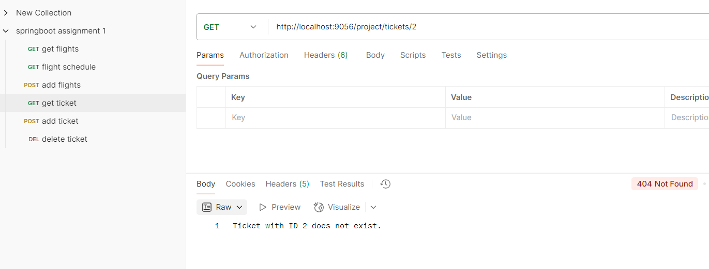

# ✈️ Airline Management System (Spring Boot)

## 📌 Overview
This project is a **Spring Boot-based Airline Management System** that allows users to:
- **View flight schedules**
- **Book tickets**
- **Retrieve ticket details**
- **Cancel tickets**
- **Ensure proper validation for duplicate bookings and errors**

## 🚀 Tech Stack
- **Spring Boot** (REST APIs)
- **Java 23**
- **Maven** (Dependency Management)
- **Spring Web** (For creating RESTful endpoints)
- **Lombok** (To reduce boilerplate code)
- **Postman** (For API testing)

## 🔧 Setup Instructions
1. Clone the repository:
   ```sh
   git clone https://github.com/yashtapre77/Airline-Reservation.git
   cd Airline-Reservation
   ```
2. Build and run the project using Maven:
   ```sh
   mvn clean install
   ```
3. The application will start on `http://localhost:9056/project`

## 📌 API Endpoints

### 1️⃣ **Get Flight Details**
- **Endpoints:** `GET /flights/`
  `GET /flights/{id}` `GET /flights?sort=asc|desc`
- **Description:** Fetches all available flights sorted by departure time.
- **Example Request:**
  ```http
  GET http://localhost:8080/flights/
  ```
   ```http
  GET http://localhost:8080/flights/{id}
  ```
   ```http
  GET http://localhost:8080/flights/?sort=asc
  ```
- **Example Response:**
  ```json
  [
    { "id": "f1", "source": "Nagpur", "destination": "Delhi", "departureTime": "2025-03-20T10:00:00" }
  ]
  ```
  - **Screenshot:**
    
    
    

---

### 2️⃣ **Get Flight Schedules by Date**
- **Endpoint:** `GET /flights/{id}/schedules?dates=startDate`
- **Example Request:**
  ```http
  GET http://localhost:8080/flights/f2/schedules?dates=2025-03-20
  ```
- **Screenshot:**
  

---

### 3️⃣ **Create a Ticket (Book Flight)**
- **Endpoint:** `POST /tickets/`
- **Example Request:**
  ```json
  {
     "id": "2",
    "passengerName": "Yash",
    "email": "abcd@gmail.com",
    "seatNumber": "A001",
    "flightId": "f2"
  }
  ```
- **Screenshot:**
  
---

### 4️⃣ **Get Ticket Details**
- **Endpoint:** `GET /tickets/{id}`
- **Example Request:**
  ```http
  GET http://localhost:8080/tickets/2
  ```
- **Screenshot:**
  

---

### 5️⃣ **Cancel Ticket**
- **Endpoint:** `DELETE /tickets/{id}`
- **Example Request:**
  ```http
  DELETE http://localhost:8080/tickets/2
  ```
- **Screenshot:**
  
  


